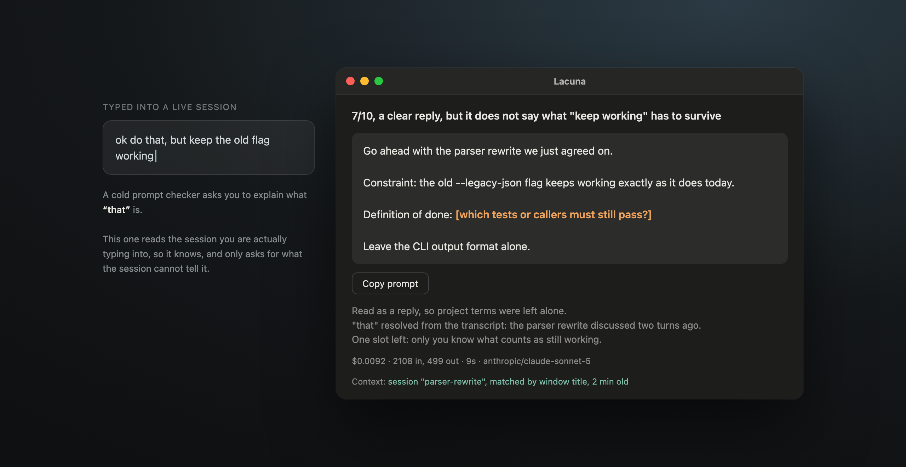

# lacuna

A lacuna is a gap in a piece of writing where something is missing. It's the blank you hit
reading an old letter with a word torn out of it: the sentence keeps going, but one piece isn't
there, so you either guess it or you notice you can't. Prompts are full of these. You know
which product you meant, which number you were looking at, what a good answer would look like,
and none of that is on the page, so the model quietly guesses and you argue with the result.

**Select a draft prompt anywhere on macOS, press one key, and see the gaps before you send
it.** It scores the draft, rewrites it, and leaves `[a bracketed slot]` wherever a fact exists
only in your head. Your own text is never touched.

Runs as a [Hammerspoon](https://www.hammerspoon.org/) module, so you need Hammerspoon and an
[OpenRouter](https://openrouter.ai/) key of your own. Each press costs about eight tenths of a
cent and the exact price shows up in the window.


## Install

```bash
brew install --cask hammerspoon
git clone https://github.com/Seryozh/lacuna.git ~/.hammerspoon/lacuna
mkdir -p ~/.config/lacuna && pbpaste > ~/.config/lacuna/key   # your OpenRouter key
```

Add one line to `~/.hammerspoon/init.lua`, then reload Hammerspoon:

```lua
lacuna = dofile(hs.configdir .. "/lacuna/lacuna.lua").start()
```

Select any text, press `Ctrl 2`. Put the key in the file above rather than in `init.lua`
itself, since plenty of people keep that directory in a public dotfiles repo.

| It asks for | Because |
| --- | --- |
| Accessibility | to copy whatever you have selected, in any app |
| Your OpenRouter key | there's no server in the middle, the call goes straight from your machine |
| Nothing else | no account, no sign-in, no telemetry |

## The slots are the point

A model can restructure your sentence all day. What it cannot do is know which metric you
meant, which flow you were looking at, or what you'd count as a good answer, so it either
interrupts you with questions or quietly invents something plausible.

Slots are the third option. The rewrite comes back complete except for the two or three facts
only you have, marked in orange, and you fill them in about ten seconds. Nothing gets made up
on your behalf, and you can see exactly where the model would have been guessing.

## It reads the session you're typing into



A prompt checker that treats every message as a cold open is useless inside real work. You
write "ok do that, but keep the old flag working" in the middle of a Claude Code session, and
it lectures you about missing context the session has known for an hour.

So when the hotkey fires inside the Claude desktop app or a terminal, it finds the Claude Code
session you're actually typing into, reads the tail of that transcript from disk, and judges a
reply as a reply. Project jargon gets left alone, "that" is resolved from the transcript, and a
slot appears only where neither your draft nor the history has the answer.

Finding the right session is the whole trick. The obvious approach, take the most recently
written transcript, is wrong: that's always the session an agent is busy writing in, not the
one you're typing into. It matches the window title against the session list the Claude app
already keeps, and falls back to the session you last had open. Which one got attached is
printed in the window, so a wrong match is visible immediately instead of quietly poisoning the
answer. Everywhere else, in a browser or in Notes or in Slack, your text is treated as a first
message, which is what it is.

## What leaves your machine

Your selected text, the frontmost app name and window title, and, inside Claude or a terminal,
the tail of that session transcript. That last one is the honest cost of the feature: a chunk
of your recent conversation goes to whichever model you configured, through OpenRouter. Every
request is shown verbatim under "What was sent" in the window, so you can check instead of
trusting me, and `sessionContext: false` in the config turns that half off entirely.

Nothing is stored anywhere except two files on your own disk: a log at
`~/.hammerspoon/lacuna.log` and a history at `~/.config/lacuna/history.jsonl`.

## Why not one of the paid apps

There are several good Mac apps that improve a selected prompt: Prompt Sloth, RewriteBar,
PromptAI, Rephrase. If what you want is a better sentence with one keypress, buy one of them,
because they're signed, they update themselves, they come with a managed key so there's no
setup, and RewriteBar's word-level diff is better than anything here.

They all share one default though, which is that they replace your text with their version. So
you get a polished prompt and no idea what was weak about yours, and when a rewrite invents a
file path or a metric you never mentioned, there's nothing marking it as invented. This does
the opposite: it never touches your text, it tells you what's missing, and it leaves the
unknowable blank on purpose.

## Config

Everything lives in `~/.config/lacuna/config.json` and every field is optional.

```json
{
  "hotkey": { "mods": ["ctrl", "alt"], "key": "p" },
  "model": "anthropic/claude-sonnet-5",
  "sessionContext": true,
  "autoSelectWhenEmpty": true
}
```

Any OpenAI-compatible endpoint works, including a local one: point `endpoint` at it and set
`apiKeyEnv`. Reasoning is off by default because with it on, the same answer took three times
longer and cost four times more, and I couldn't tell the two apart.

## When it breaks

Failing silently was the thing I most wanted to avoid, since a hotkey that does nothing is
indistinguishable from a hotkey that isn't bound. A hung request gives up after 75 seconds and
says so, errors open the same window with the raw response, and if even that window fails to
draw you get a system notification.

Nothing you type into the window lives only in the window either. Answers are written to the
history file when they arrive, your edits are saved every few seconds, and whatever is on
screen is saved again before a new check can replace it. That last part exists because I lost a
prompt I was halfway through editing, which took four seconds and felt considerably longer.

## Why it exists

I kept firing off half-formed prompts and then arguing with the answer, which was my fault
rather than the model's. Dictation software already rewrites my sentences, so that problem was
handled. The part nobody was doing was telling me what I'd left out before I hit enter.

MIT licensed, about 700 lines of Lua and no other dependencies. The instruction it runs on is a
plain string near the top of `lacuna.lua`, so if you disagree with how it judges things, that's
the paragraph to edit.
